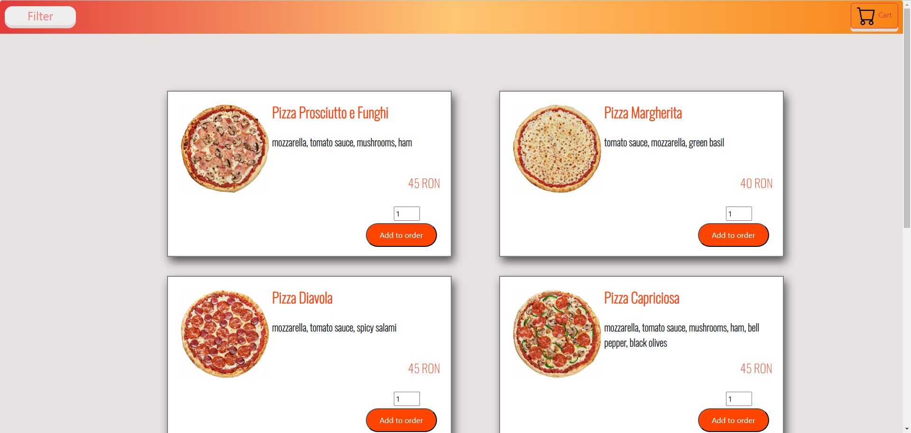

# Pizza Order Prototype

## Project Description

Pizza Order Prototype is a web application made with JavaScript, HTML, CSS and more. It is designed to help users order their favourite pizza. The website provides a list with pizzas with detailed information including lists of ingredients, allergens and images. Users can also find their desired pizza by filtering the allergens.

### Technologies Used:

- **JavaScript**
- **NodeJS**
- **ExpressJS**
- **HTML**
- **CSS**
- **BootStrap**

### Future Plans 

- implement a database using MongoDB
- implement card payment method with Stripe
- moving the frontend part in React
-  authentication & login accouns for users and administrator

## Setup

open terminal in backend directory then use the next commands:
- npm install
- node server.js (to open the application)